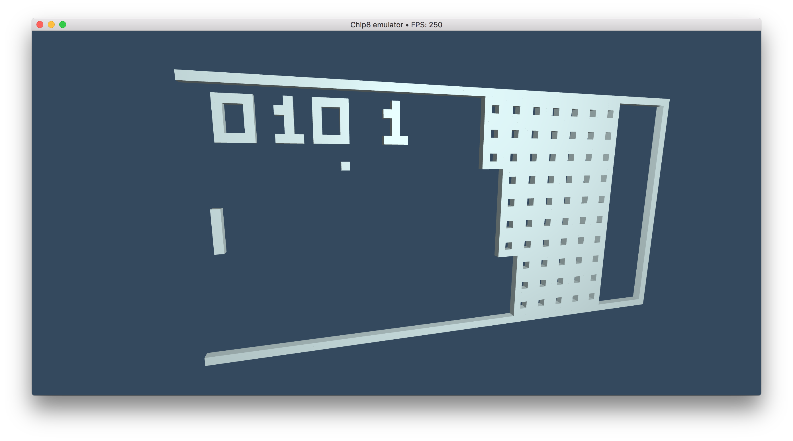
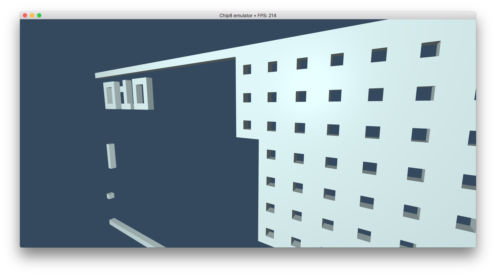
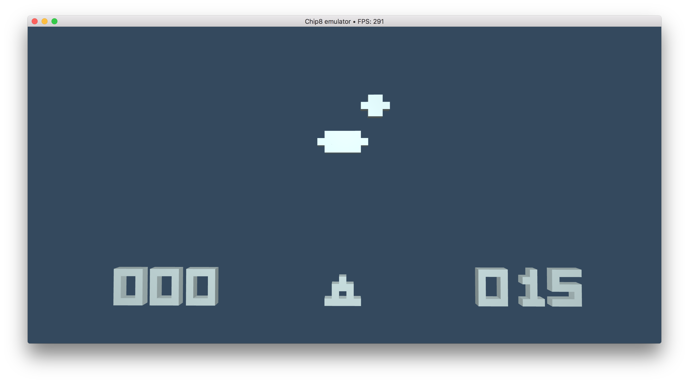
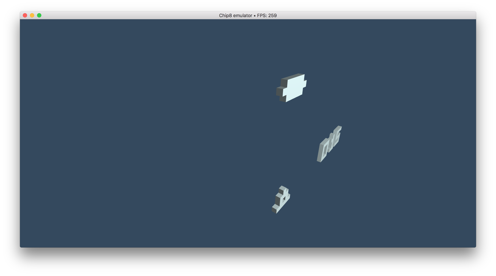

# 3D Chip8 emulator

## Motivations

I basically wanted to improve my OpenGL (and C++) skills through a fun project.
I always wanted to make an emulator, and the Chip8 is a fairly easy one to
start with. So why not making the rendering 3D to be able to move "inside"
the game.






Here is a small video of what it looks like:
[video](https://www.youtube.com/watch?v=h3pDNioWFzI)

You can use the mouse and the WASD keys to move.
The Chip8 inputs are:

keys | keys  | keys  | keys 
--- | --- | --- | ---
4 | 5 | 6 | 7
R | T | Y | U
F | G | H | J
V | B | N | M

## Dependencies

All deps should already be bundled inside the project.
The only system libs needed are `OpenGL` and `OpenAL`.

## Build

This project is using `cmake` as build system.

Inside the project root:

```bash
mkdir bin
cd bin
cmake -DCMAKE_BUILD_TYPE=Release ..
make
./chip8_run /path/to/rom
```